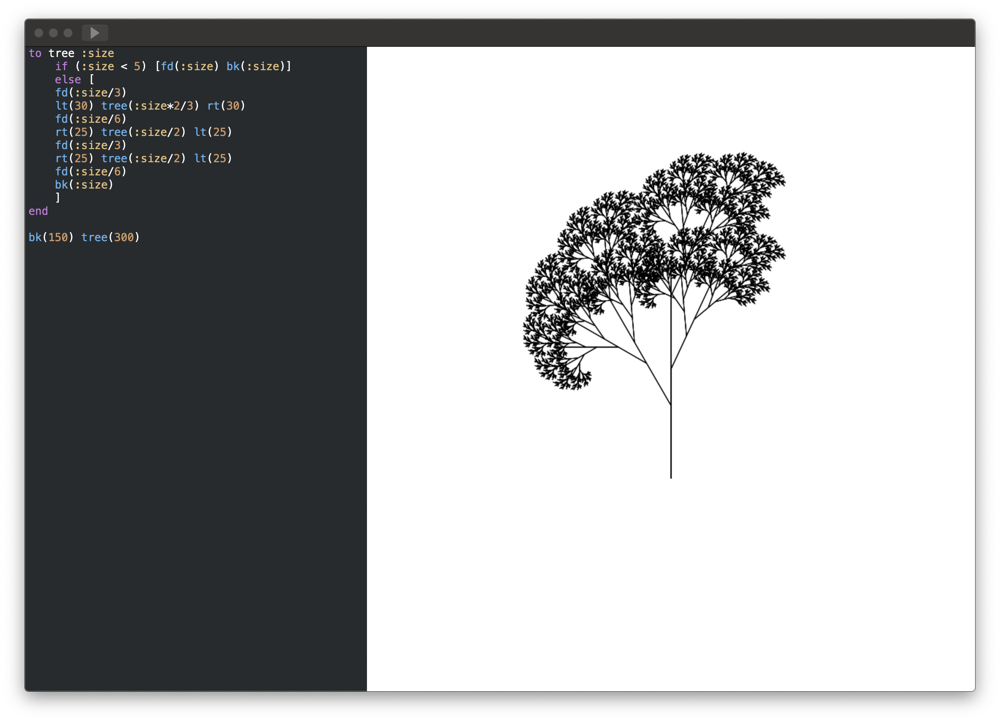
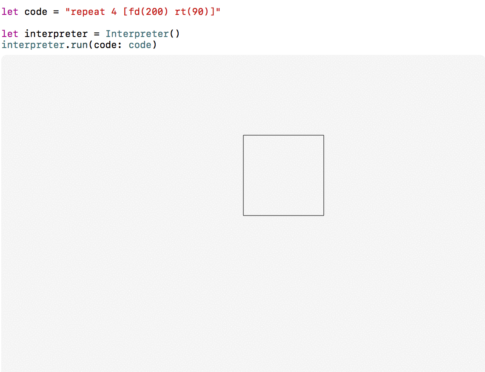

# Logo interpreter 🐢

>An interpreter is a computer program that directly executes instructions written in a programming or scripting language, without previously compiling them into a machine language program.

A Logo interpreter written entirely in Swift. Curretly supports logo syntax with basic builtin commands such as `forward`, `back`, `left`, `right`. The language reference 
and very basics of how it works are described in my [blog post ](https://wojteklu.com/post/writing-a-logo-interpreter/). You can play with interpreter using created [macOS app](https://github.com/wojteklu/logo/releases).

  

Furthermore repository contains playground with samples below. Have fun! 🐢.

  

## Contributing

I’d love to see your ideas for improving this! The best way to contribute is by submitting a pull request. I’ll do my best to respond to your patch as soon as possible. You can also submit a [new GitHub issue](https://github.com/wojteklu/logo/issues/new) if you find bugs or have questions.

## Author

Wojtek Lukaszuk [@wojteklu](http://twitter.com/wojteklu)

## License

This project is licensed under the terms of the MIT license. See the license file.